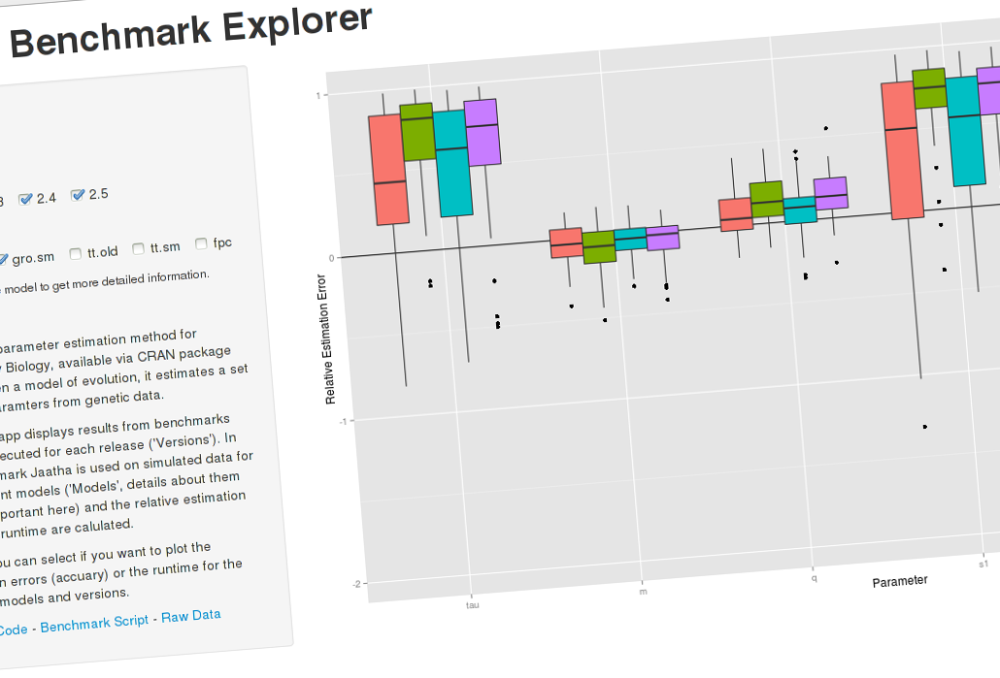

The Jaatha Benchmark Explorer
========================================================
author: Paul Staab
date: 2014-08-24


Jaatha
========================================================

Jaatha is a composite-likelihood estimation method for 
models of evolution. 

- Available as CRAN package __jaatha__.
- Uses genetic data from indiviuals of two distinct populations.
- Uses simulations to approximate the likelihood function.
- For each release a suite of benchmarks is performed.


Benchmark data
========================================================

The raw benchmark results are [available on Github](https://github.com/paulstaab/jaatha-benchmark/blob/master/data_processed/acc_and_runtime.Rda?raw=true). They consists of two datasets, one for measuring estimation accuracy and one for the runtime:


```r
head(data_acc, 2)
```

```
  version   model variable rel.error
1     2.2 gro.old      tau   0.05009
2     2.2 gro.old      tau  -0.49996
```

```r
head(data_runtime, 2)
```

```
  version   model run.time
1     2.2 gro.old   122500
2     2.2 gro.old    74507
```


The Benchmark Explorer
========================================================

The [Benchmark Explorer](http://paulstaab.shinyapps.io/jaatha-benchmark-explorer)
is a Shiny App that allows to browse the benchmark data.

- It's build using shiny, dplyr & ggplot2,
- uses ggplot2's barcharts and boxplots to display the data,
- and allows to interactively select whether to plot runtime or accuracy 
  and displayed Jaatha versions and test models. 


Check it out!
========================================================
[](http://paulstaab.shinyapps.io/jaatha-benchmark-explorer)
